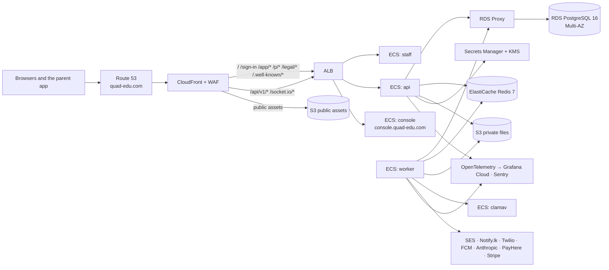

# 20 Infrastructure and operations

How Quad runs in AWS, how code reaches it, which providers it uses, and how the team keeps it healthy. Decisions D18, D19 and D21 in [02](02-architecture.md#decision-log). Staging is built in **M0b**, production in **M12** ([18](18-delivery-plan.md)).

## Architecture

Everything runs in AWS `ap-south-1` (Mumbai), across three availability zones.



## DNS and TLS

| Name | Points to | Notes |
|---|---|---|
| `quad-edu.com` | CloudFront (production) | Landing, sign-in, staff portal, API, realtime, legal, app links |
| `www.quad-edu.com` | CloudFront | 301 to `quad-edu.com` |
| `console.quad-edu.com` | CloudFront → ALB (console; `/api/v1/platform/*`, sign-in under `/api/v1/platform/auth/*` included, and `/socket.io/*` go to the API) | Separate cookie; WAF rule allows only Quad office and VPN ranges plus Google SSO callbacks (optional, off at launch) |
| `staging.quad-edu.com`, `console.staging.quad-edu.com` | Staging CloudFront | `noindex` header; basic WAF rules |
| `mail.quad-edu.com` | SES (MAIL FROM, DKIM CNAMEs) | Sending domain for all Quad email (D19) |
| `status.quad-edu.com` | Hosted status page provider | Outside AWS so it stays up when AWS is down |
| Apex MX, SPF include | Google Workspace | Quad staff mail (`support@`, `sales@`, `security@`) |

- Route 53 hosts the zone. ACM issues certificates: one in `us-east-1` for CloudFront and one in `ap-south-1` for the ALB. TLS 1.2+ with HSTS (`max-age=63072000; includeSubDomains; preload`). There are no per-school names (D12).
- CAA records allow only Amazon to issue certificates.

## Edge and routing

- **CloudFront** is the only public entry. Behaviours (D14): `/api/v1/*` and `/socket.io/*` go to the ALB with caching off and every header, cookie and query string forwarded; `/_next/static/*` and `/assets/*` cache for a year (hashed names); everything else goes to the ALB with caching off. CloudFront adds a secret origin header that the ALB requires, so the ALB cannot be reached directly; the secret rotates without downtime through two slots the ALB accepts at once (D28).
- **ALB** listener rules, each also requiring the origin header: host `console.*` with `/api/v1/platform/*` → api and with `/socket.io/*` → the api's realtime target group, the rest of `console.*` → console; `/api/v1/*` → api; `/socket.io/*` → the realtime target group; everything else → staff. The realtime target group is sticky on the ALB's own cookie (`lb_cookie`, 1 day) for the long-polling fallback, so the app sets no cookie for it; the Flutter client connects with `transports: ['websocket']` and needs no stickiness (M6). Idle timeout 120 s for WebSockets.
- **AWS WAF** on CloudFront: AWS managed rules (common, known bad inputs, SQL injection, IP reputation, anonymous IP for the console), rate rules (2,000 requests per 5 minutes per IP overall, not counting `/_next/static/*` and `/assets/*`; 100 per 5 minutes per IP on `/api/v1/auth/*`, `/api/v1/platform/auth/*` and `/api/v1/public/*`), and a geo block list kept empty by default. The common rule set's 8 KB body limit only counts and is enforced outside `/api/v1/*`, where the API's own body limits apply; the anonymous IP list's hosting-provider rule only counts, so CI runners reach the console. Application rate limits in Redis stay in place behind it ([16](16-security-privacy.md)).

## Compute (ECS Fargate)

One cluster per environment. Images are built once per commit and promoted from staging to production by digest.

| Service | Launch size (production) | Scaling | Health |
|---|---|---|---|
| `api` | 1 vCPU, 2 GB × 2 tasks | CPU 60% target, 2–8 tasks | `GET /api/v1/health/ready` (database, Redis) |
| `worker` | 1 vCPU, 2 GB × 2 tasks | Queue depth (BullMQ waiting jobs) 2–6 tasks | Heartbeat key in Redis |
| `staff` | 0.5 vCPU, 1 GB × 2 tasks | CPU 60%, 2–6 tasks | `GET /healthz` |
| `console` | 0.25 vCPU, 0.5 GB × 1 task | Fixed | `GET /healthz` |
| `clamav` | 1 vCPU, 3 GB × 1 task | Fixed (2 in term time if scan backlog alerts) | `clamd` ping; internal only (Cloud Map) |

Staging runs one task of each at the smallest size. Deploys are rolling with the ECS deployment circuit breaker and automatic rollback.

## Data

| Store | Setup |
|---|---|
| RDS PostgreSQL 16 | `db.r6g.large` Multi-AZ at launch, gp3 storage with autoscaling, encrypted with KMS, Performance Insights on. Parameter group: `rds.force_ssl=1`, `log_min_duration_statement=500`. Roles `quad_owner`, `quad_app`, `quad_platform` ([02](02-architecture.md#database-roles-and-rls-d17)) |
| RDS Proxy | In front of RDS for the api and worker (IAM auth, TLS). Staging uses Secrets Manager password auth (SCRAM-SHA-256, TLS required) until production adds IAM auth and rotation in M12. `withTenant` uses `set_config(..., true)` inside a transaction, so connections are not pinned. Migrations connect directly to RDS, not through the proxy |
| Backups | Automated backups with point-in-time recovery for **35 days**; a daily snapshot copied to `ap-southeast-1` and kept 35 days; a monthly snapshot kept 12 months. Deletion protection on |
| ElastiCache Redis 7 | `cache.t4g.medium`, primary + replica, Multi-AZ failover, TLS and AUTH, `noeviction` (queues must not lose jobs) |
| S3 | `quad-<env>-private` (uploads, exports, report PDFs; block public access; SSE-KMS; versioning with 30-day noncurrent expiry; presigned PUT, signed CloudFront GET) and `quad-<env>-public` (landing images, logo variants; behind CloudFront with origin access control). Lifecycle: `tmp/` expires after 1 day, exports after 7 days, offboarding exports (`offboarding/`) after 30 days |
| ClamAV | `clamav` service with `freshclam` updates; the `scan-file` job streams each upload to it and marks the file `clean` or `infected` ([15](15-cross-cutting.md#files)) |
| Search | PostgreSQL full-text search; no separate search service in v1 |

## Terraform (`infra/`)

```
infra/
├── bootstrap/     # tooling account: the state bucket, lock table, state KMS key and per-environment state roles
├── modules/
│   ├── network/   # VPC, 3 public + 3 private subnets, NAT gateways (1 in staging, 3 in production), the S3 gateway endpoint and interface endpoints for ECR, Secrets Manager, Logs (one zone in staging)
│   ├── data/      # RDS, RDS Proxy, ElastiCache, S3 buckets, KMS keys, the database and Redis secrets, backup copy
│   ├── app/       # ECS cluster, services, task roles, ECR, autoscaling, Cloud Map, the migrate, seed and db-bootstrap task definitions, GitHub OIDC roles
│   ├── edge/      # ALB, CloudFront, WAF, ACM
│   └── dns/       # the environment's records in the shared zone, SES domain identity and events topic
├── envs/
│   ├── global/    # tooling account: the quad-edu.com zone, records shared by every environment, DNS roles
│   ├── staging/
│   └── production/
└── observability/ # dashboards as code (staging: the CloudWatch overview)
```

- State in an S3 bucket with versioning and a DynamoDB lock table (plus Terraform's S3 lock file), one state per environment, in a separate AWS account for shared tooling (`infra/bootstrap`). Plans and applies reach it through per-environment state roles, and every backend passes the state KMS key. The zone lives in the tooling account too (`envs/global`); each environment writes only its own record names through its own DNS role. Staging and production are separate AWS accounts under AWS Organizations.
- `terraform plan` runs on every same-repository pull request that touches `infra/` (`infra.yml`), without a refresh or a lock, because the plan role may not read secret values (ruling R-pr-plan, D28). The repository is public, so only a summary (resource addresses, actions and counts) is posted as a comment, never the full plan. `apply` runs on `main` behind the `infra-staging` environment's reviewers, after a refreshed plan; a weekly refresh-only plan reports drift. An infra change that an app change needs is merged and applied first, since the app deploy does not wait for the apply.
- Tags on every resource: `env`, `service`, `owner`, `cost-centre`.
- The first deploy, the checks it must make and the runbooks are in [`infra/README.md`](../../infra/README.md).

## CI/CD (GitHub Actions)

| Trigger | Does |
|---|---|
| Pull request | Install with cache, `pnpm verify` against Docker services (no preview environments, D18), build every app and image, `terraform plan` if `infra/` changed. Required checks: typecheck, lint, unit, codegen, api-integration, e2e-smoke, build |
| Merge to `main` | The same; then, once CI is green and only for the tip of `main` (`deploy-staging.yml`), push images to ECR, run the **db-bootstrap** and **migrate** tasks on staging, deploy staging, seed it, run the smoke checks against `staging.quad-edu.com`, build the parent app `staging` flavor and upload it to TestFlight and the Play internal track |
| Release tag `v*` | Manual approval in the `production` GitHub environment, then the migrate task on production, deploy production with the same image digests, smoke check, Sentry release |
| Nightly | Maestro and `integration_test` on iOS and Android simulators (macOS runner), dependency and image scans, the OWASP ZAP baseline scan of staging (from M12) |

**Migrations.** A one-off ECS task (`node dist/migrate.js`, as `quad_owner`) runs before the new task set takes traffic; the deploy stops if it fails. Migrations are **expand/contract** only: add columns, tables and indexes (`CREATE INDEX CONCURRENTLY`) in one release; backfill in a job; remove the old shape in a later release once no running code uses it. A migration that drops or renames in place fails review.

Deploy access uses GitHub OIDC to assume an AWS role per environment; there are no long-lived AWS keys in GitHub.

## Secrets

- AWS Secrets Manager holds every secret listed in [02 → Environment variables](02-architecture.md#environment-variables); ECS injects them into tasks. Non-secret config is plain task environment.
- KMS keys: one for RDS and S3, one for field-level encryption (TOTP secrets, safeguarding, medical notes, school gateway credentials).
- Rotation: database passwords every 90 days (Secrets Manager rotation); `SESSION_SECRET`, `LINK_SIGNING_SECRET` and JWT keys support two active values (current and previous) so rotation does not sign everyone out. Runbook below.
- App signing keys and store credentials live in GitHub environment secrets: `staging-stores` for staging builds and `production` for releases, each with required reviewers and deployments from `main` only. The `staging` environment, which the staging deploy uses, allows `main` only and has no reviewers, so a merge to `main` deploys staging with no manual step (ruling R-env-approvals, D28); `infra-staging` (Terraform applies) keeps its reviewers.
- Staging (M0b) generates database passwords, the Redis token and the session and link-signing secrets in Terraform as write-only values, never in state, and rotates them by raising a version (`infra/README.md` runbooks); Secrets Manager rotation arrives with production.

## Providers

### Email (Amazon SES)
- Sending domain `mail.quad-edu.com` with SPF (`include:amazonses.com`), DKIM (Easy DKIM, 2048-bit), a custom MAIL FROM, and DMARC `p=quarantine` with reports to a Quad mailbox. The apex keeps Google Workspace (D19).
- From `"{School name} via Quad" <no-reply@mail.quad-edu.com>`; Reply-To the school's office address from School settings. Platform mail (console, billing, demo replies) comes from `Quad <hello@mail.quad-edu.com>`.
- Bounces and complaints: SES configuration set → SNS → `POST /api/v1/webhooks/ses` (signature checked) → `email_suppressions` (address, reason, at). Suppressed addresses are skipped and the school sees "Email bounced" on the person. Staging stays in the SES sandbox; production access is requested from AWS before M12.

### SMS
- Notify.lk for `+94` numbers; Twilio for every other country. The adapter picks by country code.
- Sender ID: a registered sender ID per school where the school provides one (registered with the carriers through Notify.lk, which takes about two weeks), otherwise `QUAD`. OTP messages always use `QUAD`.
- Cost: each SMS records segments and cost in `sms_usage`; the platform invoice adds a usage line per school per month (D19). Spend alerts per school and globally ([16](16-security-privacy.md)).

### Push (Firebase Cloud Messaging)
- One Firebase project per environment (`quad-dev`, `quad-staging`, `quad-prod`) so test pushes never reach real parents. FCM HTTP v1 with a service account per project.
- iOS: an APNs auth key (`.p8`) uploaded to each Firebase project; push entitlements on `com.quadedu.parent` and its flavors.
- Invalid tokens returned by FCM are removed from `devices`.

### Payments, AI and others
- School fees: each school's own PayHere or Stripe account, credentials entered in Fees → Online payments (D20). Webhooks: `POST /api/v1/webhooks/payhere` and `/stripe`, resolved by `tenant_by_gateway_account` ([02](02-architecture.md#tenant-less-entry-points-d16)).
- Platform billing: Quad's own PayHere and Stripe accounts and bank transfer.
- Anthropic API for Ask Quad, with zero-retention terms where available (D21).
- Cloudflare Turnstile for the demo request captcha ([19](19-public-site.md#demo-requests)).

## App store publishing

| Item | Setting |
|---|---|
| Developer accounts | Apple Developer Program and Google Play Console as an organisation (Quad's legal entity and D-U-N-S number), owned by a shared Quad account, two admins each |
| Listing | One app, **Quad – School & Family** (D13), category Education. Screenshots from the seeded Colombo International School |
| Bundle ids | `com.quadedu.parent` (prod), `com.quadedu.parent.staging`, `com.quadedu.parent.dev` (internal only) |
| Signing | iOS: fastlane `match` with certificates in a private encrypted repo. Android: Play App Signing with an upload key in GitHub secrets |
| Privacy | App Store privacy labels and Play Data safety form, kept in `apps/parent/store/privacy.md` and reviewed whenever data collection changes: contact info, name, photos (moments), payment info (handled by the gateway SDK), device id for push; no tracking, no ads, no data sold. Children do not use the app (it is for parents and relatives) |
| Review access | A demo account in a dedicated **App Review** school: phone `STORE_REVIEW_PHONE` with a fixed OTP that works only for that number and school, given in the review notes |
| Release | fastlane in GitHub Actions (macOS runner for iOS). Staging builds to TestFlight and the Play internal track on every `main`; production builds from release tags to App Store (phased release over 7 days) and Play (staged rollout 10% → 50% → 100%), pausing on a crash-free rate below 99.5% |
| Force update | `GET /api/v1/app/config` returns `min_version` per platform (`MIN_APP_VERSION_IOS`, `MIN_APP_VERSION_ANDROID`); older apps show "Update Quad". Raise it only when an API change cannot stay backward compatible; the API keeps `/api/v1` compatible for at least two app releases |

## Observability

- **Traces:** OpenTelemetry SDK in api, worker, staff and console; spans carry `tenant_id`, route and job name; exported over OTLP to Grafana Cloud (Tempo), or CloudWatch X-Ray if Grafana is not used. Sampling 10% plus every error and every request over 1 s (staging samples 100%).
- **Logs:** Pino JSON to CloudWatch Logs (30 days), shipped to Grafana Loki (14 days). No personal data ([15](15-cross-cutting.md#observability)).
- **Metrics:** request rate, error rate and latency per route; queue depth and failures per queue; webhook outcomes per gateway; push sent and failed; SMS segments and spend; email bounces; Ask Quad tokens, cost and latency; RDS CPU, connections and replica lag; Redis memory.
- **Errors:** Sentry for API, web and Flutter, with release tags and PII scrubbing (D21).
- **Dashboards:** Platform overview (SLOs), API, Jobs, Messaging (push, SMS, email), Payments, Ask Quad, Database. Kept as code in `infra/observability/`. Staging starts with one CloudWatch dashboard, `quad-staging-overview` (M0b), until the Grafana account exists.

## Service levels

| SLO (monthly) | Target | Measured by |
|---|---|---|
| Staff and parent sign-in succeeds | 99.9% | Synthetic sign-in every minute from two regions + server success rate |
| API availability (non-5xx on `/api/v1/*`) | 99.9% | ALB and API metrics |
| Parent push delivered to FCM within 60 s of the event | 99.9% | Event time to FCM accept time, per notification |

99.9% is about 43 minutes a month. Error-budget burn alerts at 2% in 1 hour (page) and 5% in 6 hours (ticket).

## Alerting and on-call

- Grafana alerting routes to an on-call tool (PagerDuty or Opsgenie): **page** for SLO fast burn, API 5xx above 2% for 5 minutes, database unavailable, queue backlog over 1,000 for 10 minutes, payment webhook failures over 5 in 10 minutes; **ticket** (Slack `#quad-alerts`) for slow burn, SMS spend spikes, bounce rate above 5%, ClamAV signatures older than 24 hours, certificate expiry within 21 days.
- One primary and one secondary on call, weekly rotation, school-hours priority (06:30–18:00 Asia/Colombo is when parents and teachers use Quad most). Acknowledge within 15 minutes.
- Every page gets a short incident note; customer-visible incidents get a post-incident review within 5 working days.

## Status page

`status.quad-edu.com` on a hosted status provider (outside AWS): components Staff portal, Parent app, Console, Notifications (push, SMS, email), Payments, Ask Quad. Synthetic checks update it automatically; on-call posts incident updates. Planned maintenance is announced 3 days ahead. The staff portal and parent app show a banner when a component is degraded (`GET /api/v1/app/config` carries the current notice).

## Support intake

- **In-app Help:** staff portal (profile menu → Help) and parent app (Profile → Help) open a short form (topic, message, optional screenshot) that creates a `support_tickets` row with the tenant, reporter, app version and page. Parents' tickets go to the school first (Communications inbox); the school can escalate to Quad.
- **Email:** `support@quad-edu.com` (Google Workspace) is forwarded to an inbound address processed by the worker, which matches the sender to an account and creates or updates a `support_tickets` row.
- **Console:** Support tickets view (list by status and school, assign, reply by email, link to the school page). Open tickets feed school health ([10](10-early-warning.md#schools-console)).

## Failed jobs

The console has **System → Jobs** (platform owner and admin roles): queues with waiting, active, delayed and failed counts; failed jobs with tenant, error and attempts; retry, retry all and discard (with a reason, written to `platform_audit`). Job payloads are shown with personal fields redacted.

## Runbooks (`docs/runbooks/`, M12)

| Runbook | Covers |
|---|---|
| Incident response | Severity levels, roles, communication, status page, schools to notify, data-breach notification steps and timelines |
| Deploy and rollback | Normal release, failed migration, rolling back an image, hotfix branch |
| Database restore | Point-in-time restore to a new instance, switching over, verifying |
| Single-school restore | Below |
| Tenant deletion | Below |
| Rotate secrets | Database passwords, session, link-signing and JWT keys, gateway credentials, APNs and FCM keys |
| Provider outage | SES, Notify.lk, Twilio, FCM, Anthropic (Ask Quad shows "Ask Quad is unavailable right now" and the rest of Quad works), PayHere, Stripe |
| Onboarding a school | Wizard, import ([21](21-onboarding-import.md)), sender ID, gateway setup, first sign-ins |
| Store release | Building, submitting, phased rollout, halting a rollout, raising `min_version` |
| Queue backlog | Scaling workers, finding a poison job, replaying |

## Backups and restore drills

- Quarterly **restore drill**: restore the latest snapshot and a point-in-time to a new instance in staging's account, run the schema check and row counts against production metrics, record time to restore (target RTO 4 hours, RPO 5 minutes) in the runbook log. The first drill is an M12 acceptance criterion.
- **Single-school restore** (a school deleted or damaged its own data): restore a point-in-time copy to a temporary instance; export that tenant's rows with `withPlatform` by `tenant_id` (every [T] table carries it, D17) into a staging schema; compare with live; copy back only the agreed rows inside one transaction as `quad_platform`; restore matching S3 objects from versioning; write the steps and row counts to `platform_audit`; delete the temporary instance. Needs platform owner approval and the school admin's written request.

## Tenant deletion

When a scheduled deletion falls due (30 days after it was scheduled, cancellable until then), the `delete-tenant` platform job:
1. Exports the school's data to the private bucket for the school admin to download (kept 30 days) unless they declined.
2. Deletes every [T] row for the tenant in dependency order inside batches, as `quad_platform`; append-only audit rows are kept only where law requires and are marked.
3. Deletes S3 objects under `tenants/{tenantId}/` (and their noncurrent versions).
4. Deletes Redis keys with the tenant prefix (sessions, caches, rate limits) and removes repeatable jobs for the tenant.
5. Removes the tenant from search indexes (Postgres `tsvector` rows go with the tables) and revokes every session and refresh token.
6. Keeps the `tenants` row as a tombstone (`status = deleted`, name, dates) and the platform invoices for accounting; writes a deletion certificate to `platform_audit`.

Backups age out naturally within 35 days (12 months for monthly snapshots, stated in the DPA).

## Cost notes

Approximate monthly AWS cost at launch (production): RDS Multi-AZ + Proxy about USD 450, ECS about USD 250, NAT gateways about USD 100, ElastiCache about USD 100, CloudFront, WAF, S3 and logs about USD 150. Staging about USD 300 (single-AZ, smallest sizes, one NAT). Variable costs passed through or watched: SMS (passed to schools), Anthropic tokens (monthly budget per plan, alerts at 80%, [11](11-ask-quad.md)), SES (small). Review with AWS Cost Explorer monthly; buy Savings Plans after three months of steady use.
